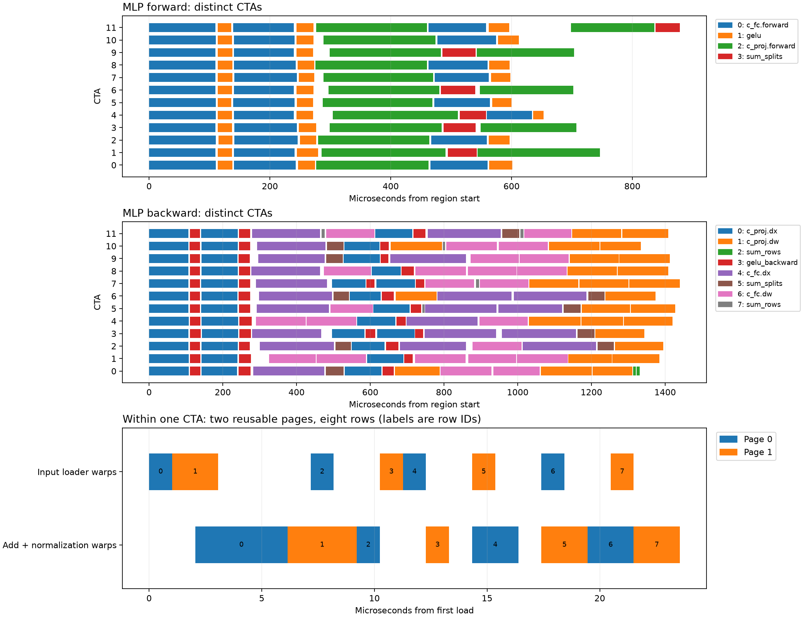

# Fine-grained scheduling and page pipelines on RTX 3080

## What this experiment implements

Ampere can execute a tile dependency graph without a grid barrier between its
instructions, and it can software-pipeline instructions using reusable CTA-local
shared-memory pages. This branch demonstrates both in actual GPT-2 training.
It starts from the RTX 3080 executor at `d1611e6`; the H100 branch is unchanged.

The scope is deliberately explicit:

- Each MLP forward and backward region is a tile DAG. GEMM, split-K reduction,
  GELU/GELU backward, and bias-gradient tiles use their actual rectangular
  dependencies, including transposed weight-gradient inputs.
- Residual addition and layer normalization share a two-page pipeline. Independent
  loader and compute warp groups overlap next-row input copies with current-row
  computation. An alternative collective `cp.async` pipeline is available.
- Attention, embeddings, optimizer updates, and boundaries between these regions
  still use the original coarse grouping and cooperative grid barriers. This is
  not a fully barrier-free model executor or a general port of Megakernels.

Parameters, gradients, activations, optimizer state, and GEMM arithmetic remain
FP32. Tensor cores, TF32, and BF16 are not used by this branch. All device code
remains inline in one translation unit.

## What was learned from Megakernels

Studied [HazyResearch/Megakernels](https://github.com/HazyResearch/Megakernels/tree/7309cec801537b61fea3b50d7dfe454a6cde578e)
at commit `7309cec801537b61fea3b50d7dfe454a6cde578e`, cloned into
`/tmp/gpt2-megakernels-study`. Its code distinguishes two mechanisms:

1. The host constructs a tile DAG and assigns instruction streams to logical
   workers. Global completion signals establish inter-CTA data dependencies.
2. Within a CTA, controller, loader, storer, launcher, and consumer roles progress
   through instruction slots and shared-memory pages. A page can be released
   before the instruction has completely retired; subsequent loads can reuse
   released pages while earlier computation continues.

The inspected configuration uses 16 KiB pages, 13 pages, and two instruction
slots. Relevant files are `megakernels/scheduler.py`, `include/megakernel.cuh`,
`include/controller/page_allocator.cuh`, `include/util.cuh`, and
`demos/low-latency-llama/matvec_pipeline.cuh`. Its demos target H100/B200 and use
TMA and architecture-specific warp-group features. Those implementations cannot
be compiled unchanged for a 3080. The dependency and page-lifetime concepts do
not require those newer features.

## Scheduling and memory ordering

`gpt2_cuda/schedule.py` compiles explicitly marked instruction regions. Each task
has exact rectangular reads/writes. Read-after-write, write-after-read, and
write-after-write intersections generate its prerequisites. Unsupported
instructions and overlapping buffers with different base addresses are rejected.
Consumers with identical prerequisite sets share one readiness counter; this
reduces atomics without making dependencies coarser.

The default ready scheduler gives workers only runnable tiles. A completing
worker immediately continues with one newly ready consumer and publishes other
ready consumers to a queue. Queue slots use release stores and acquire loads.
Prerequisite counters use acquire/release RMWs, so the last arrival carries the
writes of every predecessor. CTA barriers propagate those writes between the
worker's lanes. Completion counts are batched until a worker runs out of work.
An empty queue does not reserve a blocked consumer. One worker is sufficient
for progress on an acyclic graph.

The optional static scheduler assigns increasing task IDs round-robin to logical
workers. Each task waits only on its own prerequisite counter. The compiler
checks that every prerequisite has a smaller ID. Worker streams therefore add
no dependency cycle: the least unfinished task cannot depend on a later waiting
task. This argument additionally requires all worker CTAs to be resident. The
cooperative launcher queries actual compiled-kernel occupancy and rejects larger
grids; no SM count or physical SM affinity is assumed.

There are grid barriers when initializing and leaving a tile region, not after
each instruction or tile within it. The original whole-model scheduler remains
available for a direct ablation.

## Shared-memory page protocol

Each CTA has two 16 KiB pages. Four warps load inputs with `cp.async`; four warps
perform residual addition and normalization. The compute group uses virtual
lanes to preserve the original 256-thread reduction order.

Each page has a ready barrier and a released barrier. They use Ampere
`mbarrier.init`, `arrive`, `test_wait.parity`, and `inval`. Initial pages need no
release wait. On reuse, loaders wait for the preceding consumer generation.
Every loader waits for its own async copies; a named loader-group barrier precedes
ready publication. Consumers acquire readiness, synchronize their own group,
and release the page only after all readers finish. Both groups drain before
barrier invalidation and shared-memory reuse. The two groups do not use a
CTA-wide barrier inside their separate instruction loops.

Pages belong to a CTA. A 3080 cannot hand shared-memory pages directly to a CTA
on another SM. Cross-CTA edges use global memory and device-scoped publication;
page forwarding and overlap stay inside their owning CTA. It has no Hopper TMA,
WGMMA, thread-block clusters, or distributed shared memory. See NVIDIA's
[Ampere tuning guide](https://docs.nvidia.com/cuda/ampere-tuning-guide/),
[asynchronous programming model](https://docs.nvidia.com/cuda/cuda-programming-guide/03-advanced/advanced-kernel-programming.html),
and [PTX barrier semantics](https://docs.nvidia.com/cuda/archive/12.0.1/parallel-thread-execution/index.html).

## Verification and reproduction

```sh
python benchmarks/check_tile_schedule.py
TILE_ENGINE=static python benchmarks/check_tile_schedule.py --quick
PAGE_ENGINE=collective python benchmarks/check_tile_schedule.py --quick
python benchmarks/check_runtime.py
python benchmarks/compare.py --batch 8 --sequence 128 --steps 5 --iterations 50
PAGE_ROWS=8 python benchmarks/profile_tile_schedule.py
python benchmarks/plot_tile_schedule.py  # requires matplotlib
python benchmarks/benchmark_schedules.py --batch 8 --sequence 128 --output schedule-large.json
```

The tile test repeats launches with 1, 3, and the occupancy-limited worker count,
checks every traced dependency, and distinguishes instruction interleaving from
concurrent execution on different CTAs. It also exercises odd matrix tails,
transposes through full-model backward validation, and repeated page generations
with 1, 2, and 7 rows per task. Page widths include 64, 260, 768, and 1024.
The full-model comparison retains the original loss, logit, gradient, and updated
parameter tolerances. Runtime checks cover small/odd sequence lengths and AdamW
parameters plus both moments.

Use Compute Sanitizer **2025.3.1** (CUDA 13.0 package) on the CUDA 12.4 binary:

```sh
for engine in ready static; do
  for tool in synccheck racecheck memcheck; do
    TILE_ENGINE="$engine" timeout 300 compute-sanitizer --tool "$tool" --error-exitcode 99 \
      python benchmarks/check_tile_schedule.py --quick
  done
done
```

The CUDA 12.4 image's 2024.1.1 sanitizer reported barrier-tracking errors on this
reusable-page protocol. The same binary passes the newer synchronization and
race checks. NVIDIA's [release notes](https://docs.nvidia.com/compute-sanitizer/ReleaseNotes/index.html)
document fixes involving barrier addresses and barrier use across function calls.
Do not silently suppress sanitizer errors or infer correctness from numerical
agreement alone. Both old diagnostics and final validation logs are recorded.

Controls: `TILE_SCHEDULE=0` disables tile regions; `TILE_ENGINE=ready|static`
selects the scheduler; `PAGE_PIPELINE=0` disables page fusion;
`PAGE_ENGINE=warps|collective` selects the page implementation; `PAGE_ROWS=1..32`
overrides the occupancy-based 2–8 row default. `TILE_TRACE=1` records global-timer
timestamps outside performance measurements. Instrumentation changes timings;
use traces as ordering/overlap evidence, not as benchmark results.

## Results on the rented 3080

**Feasible, but the complete fine-grained scheduler is not yet a net speedup.**
These are full 12-layer training-step GPU times, using the same model storage,
FP32 arithmetic, and final binary. Each configuration has three interleaved
measurements of 50 steps after warmup; the table reports the median of the three
step-time medians. Page streams use 2 rows at 4 × 64 and 8 rows at 8 × 128.

| Schedule | Batch 4 × sequence 64 | Batch 8 × sequence 128 |
|---|---:|---:|
| Coarse groups | 27.06 ms | 84.18 ms |
| Coarse groups + page pipeline | 26.86 ms | 83.13 ms |
| Ready tile queue + page pipeline | 28.16 ms | 85.25 ms |
| Static tile streams + page pipeline | 28.05 ms | 84.67 ms |

Page pipelining alone improves the larger workload by about 1.25%; this is a
small gain and should be interpreted alongside timing variation in the raw
[schedule measurements](tile-scheduling/schedule-large.json). The ready scheduler
is about 1.27% slower than coarse grouping there; static scheduling is about
0.59% slower. Experimental tile scheduling is enabled by default on this branch
to exercise the requested architecture, not because it wins this comparison.

A separate matched PyTorch comparison at 8 × 128 measured 84.17 ms custom versus
85.82 ms eager PyTorch (1.02×), with five training steps checked. That establishes
approximate parity on this host; it does not demonstrate an improvement over the
coarse executor. This rental has a 240 W power cap and differs from earlier
benchmark machines. Do not attribute differences from historical results solely
to scheduling. The comparison uses eager PyTorch, not `torch.compile`.

The recorded two-layer trace shows overlapping instruction execution on different
CTAs in both forward and backward MLP regions. Identical-prerequisite grouping
reduces forward edges from 2,880 to 960 and backward edges from 9,024 to 1,344.
For the four recorded residual/normalization pipelines, 758, 669, 662, and 654
adjacent row pairs exhibit load/compute overlap. These instrumented traces are
not performance measurements.



The final kernel uses 128 registers per thread, no stack or local memory, and
32 KiB dynamic shared memory plus 112 bytes static shared memory. Its measured
cooperative capacity is 136 CTAs on 68 SMs. Scoped inline PTX atomics removed
compiler-generated local-pointer temporaries. Scheduling costs, locality, and
register pressure still need further profiling before extending page forwarding
to GEMM chains; their individual timing contributions have not been isolated.

Final validation passed full-model five-step comparisons at both workloads,
static scheduling at 8 × 128, runtime/optimizer checks, odd-tail tile checks,
and repeated page reuse. All six ready/static × synccheck/racecheck/memcheck runs
passed with Compute Sanitizer 2025.3.1. The older 2024.1.1 tool's `Missing wait`
diagnostic and exit code 99 on the same final binary are preserved separately;
the newer tool passing does not, by itself, prove that the old diagnostic is a
false positive. The barrier protocol also requires the phase-ordering argument
above and the repeated-generation tests.

Artifacts are in [tile-scheduling/](tile-scheduling/): raw benchmark JSON,
compressed traces, validation/build/resource logs, both sanitizer versions'
diagnostics, and an [environment manifest](tile-scheduling/environment.json).
The validated core source hash is
`ffa9c785413e720d4caa0a3768c8a2d7d78a3d7b7168119faf71319de0708f31`.
The instance was destroyed and its absence verified. Approximately 56 minutes
at the listed rate including disk cost **$0.12**; this is an elapsed-time estimate,
not a billing invoice.
